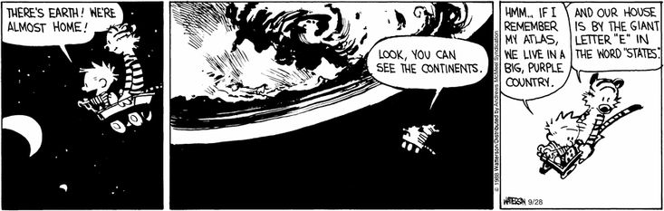

<!-- Background setup + creating datafile to work with -->


```{r setup, include=FALSE}
library(learnr) # tutorial mode
library(ggplot2) # plotting interface
library(tidyverse) # housekeeping
library(ggmap) # for quering stamen & open street map
library(sf) # spatial objects
library(rnaturalearth) # map of countries of the entire world
library(rnaturalearthhires) # to be ale to set scale = "large"
library(ggspatial) # spatially-aware scalebar and north arrow
library(cowplot) # allows combining multiple maps (insert maps)
library(leaflet) # dynamic maps
library(raster) # supports spatial plot function
library(jsonlite) # necessary for coordinates


knitr::opts_chunk$set(echo = FALSE)

countries <- map_data("world")

coordinates <- function(adresses){
  nominatim_osm <- function(address = NULL){
    ## details: http://wiki.openstreetmap.org/wiki/Nominatim
    ## nominatim_osm proposed by D. Kisler
    if(suppressWarnings(is.null(address)))  return(data.frame())
    tryCatch(d <- jsonlite::fromJSON(gsub('\\@addr\\@', gsub('\\s+', '\\%20', address),'http://nominatim.openstreetmap.org/search/@addr@?format=json&addressdetails=0&limit=1')), error = function(c) 
    return(data.frame()))
    if(length(d) == 0) return(data.frame())
    return(c(as.numeric(d$lon), as.numeric(d$lat)))
  }
  table <- t(sapply(adresses,nominatim_osm))
  colnames(table) <- c("lon","lat")
  return(table)
}


world_lowres <- rnaturalearth::ne_countries(scale="medium", returnclass = "sf") # borders of all countries in the world as an sf object (simple feature collection)

world <- rnaturalearth::ne_countries(scale="large", returnclass = "sf") # high resolution borders of all countries in the world as an sf object

location <- c("paris","villefranche","banyuls","roscoff")
lat <- c(48.8566,43.7040,42.4834,48.7262)
long <- c(2.3522,7.3111,3.1289,-3.9853)
days <- c(12,45,35,21)
places <- data.frame(location,lat,long,days)

lat_2 <- c(48.8566,43.7040,42.4834,48.8566,48.7262)
long_2 <- c(2.3522,7.3111,3.1289,2.3522,-3.9853)
travel <- data.frame(lat_2,long_2)


```

## 1. Workshop goals

* The building blocks of maps
* How to handle spatial data
* Creating beautiful, publication-ready maps
* _Bonus: Dynamic maps & Spatial networks_

* Where can I learn more?


## 2. Our first map in R

### Getting started

First, let's refresh our R skills.

In the box below, you see code to add 2 plus 2. Press the green **"Run Code"** button and take a look at the result.

```{r 1-1, exercise=TRUE}

2+2

```

These small boxes are your coding environment for this tutorial. Use them to edit existing or write your own code, e.g. to calculate 3 - 1. Do that now and check the result. 

If you want to go back to the initial code, simply press "Start Over".

### Loading packages

R comes with some basic skills (like the calculus you have just seen). In order to unleash the true power of R, you want to work with *packages*. 

Each package is a toolbox that gives R different superpowers (called "functions"). Just think of building a tree house! Before you can start, you have to learn how to cut wood and use a hammer.

```{r 1-2, exercise=T}

# The packages below are already pre-loaded in this tutorial. You don't need to do anything here.

# library(ggplot2) # R's plotting abilities
# library(tidyverse) # housekeeping
# library(ggmap) # access to openstreetmap and stamenmaps
# library(sf) # simple working with spatial objects
# library(rnaturalearth) # map of countries of the entire world
# library(rnaturalearthhires) # high-resolution maps (scale = "large")
# library(ggspatial) # spatially-aware scalebar and north arrow
# library(jsonlite) # helps finding coordinates of locations
# library(cowplot) # allows combining multiple maps (e.g. small insert maps)
# library(leaflet) # dynamic maps

```

### Creating simple maps using ggplot2

A very simple way of creating a map is by using the versatile ggplot2 package (the gold-standard of plotting in R). The package 1) stores some spatial information and 2) gives you the functions to plot them. So that's all we need to get started!

Using the map_data() function, we can easily get the coordinates of outlines for each country of the world and store it in the variable "countries". Using the function head(), we can inspect the data.

```{r 1-3, exercise=TRUE,exercise.lines = 4}

countries <- map_data("world") # get coordinates of country outlines for the entire world

head(countries, 20) # coordinates for borders of every country in the world

```

<br>

The code below uses this same data to plot a world map.

```{r 1-4, exercise=TRUE,exercise.lines = 4}

ggplot(countries, aes(x=long,y=lat,group=group))+ # group makes sure countries fit together
  geom_polygon(color="black", fill="grey")+
  theme_minimal()

```

```{r 1-4-hint, exercise.lines = 3}

ggplot(countries, aes(x=long,y=lat,group=group))+ #group makes sure countries fit together
  geom_polygon()

```

**Congratulations, you just plotted your first map! You're really a fast learner :)**

Now play around with the color and fill parameters and see how the map changes. For example, try changing the color to "blue" instead of "black".

## 3. More sophisticated maps using ggmap

Using the package *ggmap*, we can create more sophisticated maps. These maps are based on images retrieved from OpenStreetMap and StamenMap data.

For plotting a map with *ggmap*, we need to know:

1) The boundary coordinates of the location we want to plot (top, bottom, left & right).
2) Our desired zoom level, ranging from 1 (coarse) to 18 (very detailed).

Let's try it out (using the get_stamenmap() function). In the code below, I already included the boundary coordinates for Lombok, Indonesia.

```{r 2-1, exercise=TRUE, exercise.lines = 4}

map_lombok <- get_stamenmap(c(top = -8.0, bottom = -9.2, left = 115.65, right = 116.9), zoom = 10, maptype="terrain")

ggmap(map_lombok)

```

Wow, that was easy! Let's try plotting the Gili islands now. What's the difference to the code above?

```{r 2-2, exercise=TRUE, exercise.lines = 4}

map_gili <- get_stamenmap(c(top = -8.3, bottom = -8.4, left = 116, right = 116.12), zoom = 14, maptype="terrain")

ggmap(map_gili)

```

For the above map, reduce the zoom level to 10. What is happening here?

----------------------

Besides the "terrain"-maps, we can also create less colorful maps using shades of black and white ("toner-lite"). 

Using such a map as a background (or base map), you can add points to indicate a point of interest, such as a specific village or particular reef. Check out the "hint" in the box below to see how to do that.

```{r 2-3, exercise=TRUE, exercise.lines = 4}

map_gili_toner <- get_stamenmap(c(top = -8.3, bottom = -8.4, left = 116, right = 116.12), zoom = 14, maptype="toner-lite")

ggmap(map_gili_toner)

```

```{r 2-3-hint, exercise.lines = 4}

# Add this code into your console (note the + after "ggmap(map_gili_toner)") to add a dot for the location of Gili Trawangan.

ggmap(map_gili_toner)+
  geom_point(aes(x=116.035,y=-8.35))

```

Pretty boring. Let's get a bit more artistic!

```{r 2-4, exercise=T, exercise.lines = 4}

map_gili_watercolor <- get_stamenmap(c(top = -8.3, bottom = -8.41, left = 115.99, right = 116.13), zoom = 14, maptype="watercolor")

ggmap(map_gili_watercolor)

```

Creating nice maps in R is pretty easy, right?

<br>

### Exercise

Now it's your turn. Please 1) create a watercolor map of your study site or favorite location (Hint: Open googlemaps and use the right-mouse click to get the respective coordinates) and 2) add a red dot somewhere on your map.

```{r 2-5, exercise=TRUE, exercise.lines = 7}

```


```{r 2-5-hint, exercise.lines = 3}

# To calculate the boundary coordinates, simply add and substract 1 degree to the longitude and latitude you got from googlemaps.

```

<br>

*PS: ggmap also integrates nicely with googlemaps (you get access to an amazing set of maps and satellite images). However, google has recently changed its API requirements, and ggmap users are now required to provide an API key and billing information (i.e. credit card info!) and google now charges you each time you obtain a map. Better stick to the other providers such as Stamen Maps (as used above).*


## 4. Let's talk coordinates

Wouldn't it be nice to NOT have to search for coordinates by hand?

We can give R a new superpower, by creating our own function that helps us with this. The code below scrapes the coordinates of (almost) any place you can think of based on OpenStreetMap data. You simply need to type in *coordinates("Location of your choice")*.

```{r 3-1, exercise=TRUE, exercise.lines = 5}

# Don't worry about this code here. This function has already been loaded for you!

# coordinates <- function(adresses){
#  nominatim_osm <- function(address = NULL){
    ## nominatim_osm proposed by D. Kisler
#    if(suppressWarnings(is.null(address)))  return(data.frame())
#    tryCatch(d <- jsonlite::fromJSON(gsub('\\@addr\\@', gsub('\\s+', '\\%20', address),'http://nominatim.openstreetmap.org/search/@addr@?format=json&addressdetails=0&limit=1')), error = function(c) 
#    return(data.frame()))
#    if(length(d) == 0) return(data.frame())
#    return(c(as.numeric(d$lon), as.numeric(d$lat)))}
#  table <- t(sapply(adresses,nominatim_osm))
#  colnames(table) <- c("lon","lat")
#  return(table)}

```

Let's try it out. Can you find the coordinates 1) for Lombok and 2) for the Gili islands?

```{r 3-2, exercise=TRUE}

coordinates("Rütenhöfe, Bremen")

```

### Exercise

Find the coordinates of your study site and plot them on a simple map (using the code below).

```{r 3-3, exercise=TRUE, exercise.lines = 7}

ggplot(countries, aes(x=long,y=lat,group=group))+ #group makes sure countries fit together
  geom_polygon(fill="grey")+
  geom_point(aes(x=0,y=0))+
  theme_minimal()

```


### A small wrap-up

Let's see what you have learned so far ...

```{r quiz}
quiz(
  question("A map in R ...",
    answer("is very easy to produce.", correct = TRUE),
    answer("consists of several layers stacked on top of each other.", correct = TRUE),
    answer("is highly customizable and can fit all my needs.", correct = TRUE)),
  
  question("Should you pay google to produce nice maps?",
    answer("No, there are great tools to do the same for free.", correct = TRUE),
    answer("No, Google does not need my money and I know how to do this all by myself already.", correct = TRUE)))
```


## 5. Mapping 2.0 

A particularly powerful package when dealing with spatial data is called *rnaturalearth*, which includes spatial information of every country in the world. Coupled with a package called *sf*, creating customized and good-looking maps (for free!) becomes a breeze.

The *rnaturalearth* package has an older brother called *rnaturalearthhires*, that includes high resolution spatial data (that's exactly what we want). Yey! :)


```{r 3-4, exercise=TRUE}

# library(rnaturalearth)
# library(rnaturalearthhires)

```

To access the spatial polygons of all countries on earth we can use the ne_countries() command.

```{r 3-5, exercise=TRUE, exercise.lines = 4}

world_lowres <- ne_countries(scale="medium", returnclass = "sf") # borders of all countries in the world

world <- ne_countries(scale="large", returnclass = "sf") # High Resolution (!) borders of all countries in the world

```

Let's check out the data structure.

```{r 3-6, exercise=TRUE}

head(world_lowres[c("name","continent","subregion")])

```

Using the ggplot2 language, we can plot the underlying spatial objects.

```{r 3-7, exercise=TRUE, exercise.lines = 4}

ggplot(data = world_lowres) +
  geom_sf()

```

Ok, that's not new for us. However, using sf objects makes working with spatial data super easy. Let's try changing the projection (using the coord_sf() function).

```{r 3-8, exercise=TRUE, exercise.lines = 5}

ggplot(data=world_lowres) +
  geom_sf()+
  coord_sf(crs = "+proj=moll") +# change the projection to Mollweide
  labs(title='Mollweide Projection')

```

We can also use spherical projections.

```{r 3-9, exercise=TRUE, exercise.lines = 5}

coordinates("Senegal")

ggplot(data=world_lowres) +
  geom_sf(col = 'black',fill="antiquewhite")+
  coord_sf(crs = "+proj=ortho +lat_0=14 +lon_0=-14") + # change the projection
  labs(title='Spherical Projection')

```

Using the coord_sf() command, we can zoom in to certain regions, such as the Indonesian archipelago.

```{r 3-10, exercise=TRUE, exercise.lines = 6}

coordinates("Indonesia")

ggplot(data = world_lowres) +
  geom_sf()+
  coord_sf(xlim = c(90,140), ylim=c(-15,15))

```

<br>

Do you still remember that we just downloaded two different datasets? 

1) "world_lowres" for lower resolution and 2) "world" for high resolution data.

Let's try spotting the difference between the two, taking the example of Lombok.

```{r 3-11, exercise=TRUE, exercise.lines = 12}

coordinates("Lombok")

ggplot(data = world_lowres) +
  geom_sf()+
  coord_sf(xlim = c(115.4,117.2),ylim=c(-9.3,-7.8))

ggplot(data = world) +
  geom_sf()+
  coord_sf(xlim = c(115.4,117.2),ylim=c(-9.3,-7.8))

```

That's quite some difference, right? In any case, it seems like you are in bad luck if you work on the Gili islands.

<br>

### Exercise

Below you see a somewhat automated code to produce study site maps:

1) Use the coordinates() function to find latitudes and longitudes for "Sechura Bay" in Peru. (You are already an expert in this!)
2) Add the name of the country you want to plot in the "country_of_your_choice" variable. (The square brackets [ ] are used to subset datasets based on certain conditions.)
3) Create a map using the ggplot code below.

Can you see what's happening here? 

```{r 3-13, exercise=TRUE, exercise.lines = 8}

site <- coordinates("ZMT Bremen")
country <- world[world$name=="Germany",]

ggplot(data = country)+
  geom_sf()+
  geom_point(aes(x=site[1],y=site[2]),col="black",fill="orange",shape=21, size=2)+
  xlab("Longitude")+ylab("Latitude")

```


## 6. Study site maps in under 2 minutes

We now know how to map, and find the coordinates of (almost) any place on earth and have seen how to semi-automate this process.

The code below takes this one step further:

1) We produce a study site map, using the coordinates of a location, its name and the desired map extent (i.e. latitude and longitude of a place ± an extent indicated in degrees).

```{r 4-1, exercise=TRUE, exercise.lines = 20}

location <- coordinates("Lombok") # Check if the found coordinates match your intended location. If not, supply them manually.
site <- "Lombok"
country <- "Indonesia"
extent = 0.9 # Adjust "extent" (in degrees) based on desired map extent

## Map of the study site

study_site <-
  ggplot(data = world) +
  geom_sf(fill = ifelse(world$name == country, "grey80","grey90"))+
  geom_point(aes(x=location[1],y=location[2]),col="black",fill="orange",shape=21, size=2)+
  coord_sf(xlim = c(location[1]+extent,location[1]-extent),ylim=c(location[2]+extent,location[2]-extent),expand=F)+
  annotation_scale(location = "bl", width_hint = 0.5, text_cex = 0.9)+
  annotation_north_arrow(location = "bl", which_north = "true", pad_x = unit(0.25, "in"),   pad_y = unit(0.35, "in"),     style = north_arrow_fancy_orienteering)+
  annotate(geom = "text", x = location[1]+extent/15, y = location[2]-extent/11, label = site, color = "grey22", size = 5, angle = 0)+ #adjust the - parameter in y to fit.
  xlab("Longitude")+ylab("Latitude")+
  theme_bw()

study_site

```

2) We create a map of the wider region, using the coordinates of the same location, the respective country (to be highlighted) as well as a wider area of interest (from subregion to continent, see options below).

```{r 4-2, exercise=TRUE}

location <- coordinates("Lombok") # Check if the found coordinates truly match your intended location. If not, add them manually.
country <- "Indonesia"
extent = 0.9 # Adjust "extent" (in degrees) based on desired map extent
area_of_interest <- "continent" ## Choose appropriate option: continent, region_wb,region_un or subregion

area <- world_lowres[world_lowres[[area_of_interest]]==paste(world_lowres[world_lowres$name==country,][[area_of_interest]]),]

wider_area <- 
  ggplot(data = area) +
  geom_sf(fill=ifelse(area$name==country,"grey70","grey90"))+
  geom_rect(aes(xmin = location[1]-extent, xmax = location[1]+extent, ymin = location[2]-extent, ymax = location[2]+extent),
            col="black",fill=NA,size=0.8)+
  theme_void()

wider_area

```

*Does this appropriately portray your region of interest? If not, change the area of interest to one of the indicated options.*

<br>

3) We combine both maps into a single plot.

```{r 4-3, exercise=TRUE, exercise.lines = 40}

location <- coordinates("Lombok") # Check if the found coordinates match your intended location. If not, supply them manually.
site <- "Lombok" # name of the site of interest for labeling
country <- "Indonesia"
extent = 0.9 # Adjust "extent" (in degrees) based on desired map extent
area_of_interest <- "continent" ## Choose option: continent, region_wb,region_un or subregion

## Map of the study site

study_site <-
  ggplot(data = world) +
  geom_sf(fill = ifelse(world$name == country, "grey80","grey90"))+
  geom_point(aes(x=location[1],y=location[2]),col="black",fill="orange",shape=21, size=2)+
  coord_sf(xlim = c(location[1]+extent,location[1]-extent),ylim=c(location[2]+extent,location[2]-extent),expand=F)+
  annotation_scale(location = "bl", width_hint = 0.5, text_cex = 0.9)+
  annotation_north_arrow(location = "bl", which_north = "true", pad_x = unit(0.25, "in"),   pad_y = unit(0.35, "in"),     style = north_arrow_fancy_orienteering)+
  annotate(geom = "text", x = location[1]+extent/15, y = location[2]-extent/11, label = site, color = "grey22", size = 5, angle = 0)+ #adjust the - parameter in y to fit.
  xlab("Longitude")+ylab("Latitude")+
  theme_bw()

study_site

### Map of the region

area <- world_lowres[world_lowres[[area_of_interest]]==paste(world_lowres[world_lowres$name==country,][[area_of_interest]]),]

wider_area <- 
  ggplot(data = area) +
  geom_sf(fill=ifelse(area$name==country,"grey70","grey90"))+
  geom_rect(aes(xmin = location[1]-extent, xmax = location[1]+extent, ymin = location[2]-extent, ymax = location[2]+extent),col="black",fill=NA,size=0.8)+
  theme_void()

wider_area

# After this step, check if the wider_area appropriately portrays your region of interest

# Combine both plots

plot_grid(study_site,wider_area)

```

Wow, that's quite cool, right? And you certainly can't wait to dive deeper :)

<br>

*If you want more, use this link to search and download high resolution data of the world: https://www.naturalearthdata.com/downloads/*

*You can download spatial data for physical features (like coastline, land, ocean, lakes, minor_islands, reefs, bathymetry) or cultural features (like populated_places, urban_areas or roads).*

## 7. Adiska's plot

**Based on what we have learned so far, let's create a nice study site map for Adiska. For this, we will switch to R Studio.**

Adiska's wishlist:

* Map of Lombok
* Include administrative divisions (West, East, Central & North Lombok, Mataram City)
* Remove lat/long grid

*These administrative divisions correspond to administrative Level 2. rnaturalearth only includes administrative borders up to level 1 = state boundaries within countries. Beyond that, we rely on more detailed shapefiles that can often be downloaded from the internet.*

    
```{r 5-1, exercise=TRUE}

plot(ne_states(country="indonesia"))

```

The code below does NOT run in this tutorial. I included it for your reference, so feel free to use and adapt it to create your own maps.

```{r 5-2, exercise=TRUE}

# The shapefile containing administrative levels of Indonesia up to the village level was downloaded from https://data.humdata.org/dataset/cod-ab-idn?

# admin_indonesia <- read_sf("idn_adm_bps_20200401_shp/idn_admbnda_adm2_bps_20200401.shp")
# 
# village1 <- coordinates("Sekotong, Lombok") 
# name_village1 <- "Sekotong"
# 
# village2 <- coordinates("Lembar, Lombok")
# name_village2 <- "Lembar"
# 
# village3 <- coordinates("Sugian, Lombok") 
# name_village3 <- "Sugian"
# 
# village4 <- coordinates("Jerowaru, Lombok") 
# name_village4 <- "Jerowaru"
# 
# # unique(admin_indonesia$ADM1_EN)
# 
# admin_nusa_tenggara_barat_bali <- admin_indonesia[admin_indonesia$ADM1_EN=="Nusa Tenggara Barat" | admin_indonesia$ADM1_EN=="Bali",]
#        
# adiska <- ggplot(data = admin_nusa_tenggara_barat_bali) +
#   
#   geom_sf(fill="grey80")+
#   
#   coord_sf(xlim = c(location[1]+extent,location[1]-extent),ylim=c(location[2]+extent   ,location[2]-extent),expand=F)+
#   
#   annotate(geom = "text", x = location[1], y = location[2], label = site, fontface = "italic", color = "grey22", size = 5, angle = 0)+
# 
#   xlab("Longitude")+ylab("Latitude")+
#   
#   theme_bw()+
#   theme(panel.grid.major = element_blank(), panel.grid.minor = element_blank())+
#   
#   annotation_scale(location = "bl", width_hint = 0.5, text_cex = 0.9)+
#   annotation_north_arrow(location = "bl", which_north = "true", pad_x = unit(0.25, "in"), pad_y = unit(0.35, "in"),     style = north_arrow_fancy_orienteering)+
#   
#   geom_point(aes(x=village1[1],y=village1[2]),col="black",fill="black",shape=21, size=2)+
#   annotate(geom = "text", x = village1[1]-extent/15, y = village1[2]+extent/10, label = name_village1, color = "grey22", size = 5, angle = 0)+
#   
#   geom_point(aes(x=village2[1],y=village2[2]),col="black",fill="black",shape=21, size=2)+
#   annotate(geom = "text", x = village2[1]+extent/15, y = village2[2]-extent/10, label = name_village2, color = "grey22", size = 5, angle = 0)+
#   
#   geom_point(aes(x=village3[1],y=village3[2]),col="black",fill="black",shape=21, size=2)+
#   annotate(geom = "text", x = village3[1]+extent/15, y = village3[2]-extent/10, label = name_village3, color = "grey22", size = 5, angle = 0)+
#   
#   geom_point(aes(x=village4[1],y=village4[2]),col="black",fill="black",shape=21, size=2)+
#   annotate(geom = "text", x = village4[1]+extent/15, y = village4[2]-extent/10, label = name_village4, color = "grey22", size = 5, angle = 0)
# 
# plot_grid(adiska,wider_area)

```

## 8. Dynamic maps & Spatial networks

This is a sneak peak of where you may want to go next ..

**Dynamic maps**

```{r 6-1, exercise=TRUE, exercise.lines = 14}

leaflet_area <- coordinates("Lombok")
#point_of_interest <- coordinates("Gili Trawangan")

map <- leaflet()
map <- addTiles(map)
map <- setView(map, lng=leaflet_area[1], lat = leaflet_area[2], zoom = 8)
#map <- addProviderTiles(map, "Wikimedia", group = "OpenStreetMap")
#map <- addProviderTiles(map, "Esri.WorldImagery",group = "World Satellite")
#map <- addProviderTiles(map, "Esri.OceanBasemap", group = "Ocean Basemap")
#map <- addCircleMarkers(map, lng=point_of_interest[1], lat=point_of_interest[2], popup="Definitely check this out!")
#map <- addLayersControl(map, baseGroups = c("OpenStreetMap", "World Satellite", "Ocean Basemap"), options = layersControlOptions(collapsed = FALSE))
#map <- addMiniMap(map, tiles = "OpenStreetMap", toggleDisplay = TRUE, position = "bottomleft") %>%  htmlwidgets::onRender("function(el, x) {var myMap = this; myMap.on('baselayerchange', function (e) {myMap.minimap.changeLayer(L.tileLayer.provider(e.name));})}")
map

```


----------------------

**Spatial networks**

```{r 7-3, exercise=TRUE, exercise.lines = 5}

plot(ne_states(geounit = "france"))
lines(travel$long,travel$lat, col="#762a83",lwd=5)
points(x=places$long, y=places$lat, pch=21,
       cex=places$days/10, col="black",bg="orange")

```

Wonderful, we did it! :) **Definitely get in touch if you want to combine spatial data and networks!**

## 9. Wrap-Up & Next steps

Well done! You are already mapping-professionals :) 



I am sure can't wait to add a nice study site map to your next paper or report.

----------------------

If you want to dive deeper, here are some helpful resources:

- Introduction to mapping in R: https://bookdown.org/dereksonderegger/444/graphing-maps.html

- Introduction to ggmap: https://journal.r-project.org/archive/2013-1/kahle-wickham.pdf

- ggmap cheatsheet: https://www.nceas.ucsb.edu/sites/default/files/2020-04/ggmapCheatsheet.pdf

- Maps with sf and ggplot: https://datascience.blog.wzb.eu/2019/04/30/zooming-in-on-maps-with-sf-and-ggplot2/

- More on sf and ggplot: https://r-spatial.org/r/2018/10/25/ggplot2-sf.html

- Diving into rnaturalearth: https://cran.r-project.org/web/packages/rnaturalearth/vignettes/rnaturalearth.html

- Downloading high resolution data: https://www.naturalearthdata.com/downloads/

- Leaflet tile providers: http://leaflet-extras.github.io/leaflet-providers/preview/


----------------------

Code needed to create outputs on computers:

rmarkdown::run("introduction.Rmd")

